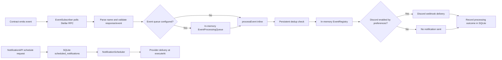

# Contributor Guide: Blockchain Event Lifecycle

This guide follows a Soroban contract event from the Stellar ledger into the
NotifyChain listener. The primary real-time path is implemented in
`listener/src/services/event-subscriber.ts`. A chain event can be shown in the
events API and sent to Discord, but it is **not automatically converted into a
durably scheduled notification**. The optional durable scheduling API is a
separate workflow described below.

## 1. Event Detection

Contracts emit events to the Stellar ledger when their methods execute. The
listener's `EventSubscriber` polls Stellar RPC with `server.getEvents()` for
each configured contract address. Polling repeats at the configured interval;
the subscriber continues from its in-memory cursor when available, or starts
from a configured backfill point on cold start.

Start with:

- [`listener/src/services/event-subscriber.ts`](listener/src/services/event-subscriber.ts): polling loop, contract filters, RPC request, and event handoff.
- [`listener/src/config-schema.ts`](listener/src/config-schema.ts): listener configuration schema, including polling and contract settings.
- [`CONTRACT_EVENT_REFERENCE.md`](CONTRACT_EVENT_REFERENCE.md): contract event names, topics, and payload shapes.

## 2. Parsing

Stellar RPC returns event records containing an ID, ledger, type, topics,
value, and transaction hash. `getEventName()` scans the topic values for a
symbol or string name. When the accepted raw event is added to the event feed,
`EventRegistry.addFromInput()` formats the topic and value into display-safe
data; Discord formatting uses the raw event and extracts the name as needed.

Relevant code:

- [`listener/src/utils/event-utils.ts`](listener/src/utils/event-utils.ts): topic-name extraction and event-filter matching.
- [`listener/src/store/event-registry.ts`](listener/src/store/event-registry.ts): converts raw event fields into `DisplayEvent` values for the API.
- [`listener/src/utils/scval-format.ts`](listener/src/utils/scval-format.ts): formats Soroban `ScVal` topics and values.

## 3. Validation and Filtering

Validation happens at two levels. Before examining individual events,
`validateRpcResponse()` rejects a missing or malformed RPC response. For each
event, `shouldProcessEvent()` checks expiration, required event fields, then
the configured event-name allowlist. Invalid or disallowed events are skipped
before they enter the processing queue or event registry.

`validateEventPayload()` checks the event ID, type, non-negative ledger,
topic array, and presence of a value. This is structural validation; it does
not re-run the contract's business rules against ledger state. The event
allowlist may be empty or contain `*` to accept all names.

Relevant code:

- [`listener/src/services/event-subscriber.ts`](listener/src/services/event-subscriber.ts): ordering of expiration, payload checks, filtering, and handoff.
- [`listener/src/utils/event-utils.ts`](listener/src/utils/event-utils.ts): RPC-response and event-payload checks.
- [`listener/src/types/index.ts`](listener/src/types/index.ts): listener and contract configuration types.

## 4. Persistence and Event Visibility

Event visibility and durable processing records are different stores:

- `EventRegistry` is **in memory**. It supplies the event feed exposed by the
  events API and prunes entries by TTL or capacity. It is not an event-history
  database and its contents do not survive a process restart.
- When `EventDeduplicationService` is configured, `processed_events` records
  event identity and the processing outcome in SQLite. This lets the listener
  detect already-processed events across restarts and avoid duplicate sends.
  `polling_cursors` holds cursor/reorg tracking data.
- These records are not a durable copy of every complete raw contract event.

Persistent duplicate checking occurs in `processEvent()` before the event is
added to the registry. The processing outcome is recorded after the delivery
attempt (or as `SKIPPED` for a duplicate). Database failures are logged and do
not intentionally stop the event loop.

Relevant code:

- [`listener/src/services/event-deduplication-service.ts`](listener/src/services/event-deduplication-service.ts): persistent duplicate checks, outcomes, and cursor/reorg records.
- [`listener/src/database/schema.sql`](listener/src/database/schema.sql): `processed_events` and scheduled-notification table definitions.
- [`listener/src/store/event-registry.ts`](listener/src/store/event-registry.ts): bounded, TTL-based in-memory event feed.
- [`listener/src/api/events-server.ts`](listener/src/api/events-server.ts): HTTP routes including event retrieval and scheduled-notification entry points.

## 5. Scheduling and Queuing

There are two mechanisms with different guarantees:

1. **Event processing queue:** If `eventQueue` is configured,
   `EventProcessingQueue` defers accepted chain events for in-process work,
   with concurrency and retry controls. Its queue is in memory, so it is not a
   durable job store. Without it, `EventSubscriber` calls `processEvent()`
   inline.
2. **Durable notification scheduling:** `NotificationAPI.scheduleNotification()`
   validates a future `executeAt` and writes a row through
   `ScheduledNotificationRepository`. `NotificationScheduler` later claims
   due rows, coordinates processing locks, and dispatches them. This workflow
   can optionally refer to an originating `eventId`, but chain-event ingestion
   does not automatically create one of these rows.

Relevant code:

- [`listener/src/services/event-processing-queue.ts`](listener/src/services/event-processing-queue.ts): optional in-memory chain-event queue.
- [`listener/src/services/notification-api.ts`](listener/src/services/notification-api.ts): durable schedule validation and creation.
- [`listener/src/services/scheduled-notification-repository.ts`](listener/src/services/scheduled-notification-repository.ts): SQLite persistence and claiming/locking of due rows.
- [`listener/src/services/notification-scheduler.ts`](listener/src/services/notification-scheduler.ts): background processing of scheduled notifications.

## 6. Delivery

For the real-time path, `processEvent()` checks the user's Discord preference
(`contractConfig.userId`, or `global`) and calls
`DiscordNotificationService.sendEventNotification()` when Discord is enabled.
The service deduplicates sends in memory, formats and sanitizes the message,
and posts it through the webhook sender. A successful HTTP response is treated
as delivery success. The service retries failures internally; if it ultimately
returns failure, the subscriber can place the event on its optional in-memory
`NotificationRetryQueue`.

The durable scheduled path instead dispatches a claimed notification through
the configured provider registry when its execution time arrives. Its retry
and execution history are backed by the scheduled-notification persistence
workflow, not the real-time event queue.

Relevant code:

- [`listener/src/services/discord-notification.ts`](listener/src/services/discord-notification.ts): real-time Discord formatting, deduplication, webhook attempts, and result.
- [`listener/src/services/webhook-sender.ts`](listener/src/services/webhook-sender.ts): HTTP webhook transport.
- [`listener/src/services/notification-retry-queue.ts`](listener/src/services/notification-retry-queue.ts): optional in-memory retry queue for failed real-time sends.
- [`listener/src/services/provider-registry.ts`](listener/src/services/provider-registry.ts): providers used by durable scheduled delivery.

## Where to Trace the Flow

For a focused code reading, follow `EventSubscriber.checkForEvents()` to
`shouldProcessEvent()`, then to `processEvent()`. From there, follow the calls
to `EventDeduplicationService`, `EventRegistry`, and
`DiscordNotificationService`. For durable future delivery, start at
`NotificationAPI.scheduleNotification()`, then follow the repository into
`NotificationScheduler`.

Useful neighboring tests include
[`listener/src/services/event-subscriber.test.ts`](listener/src/services/event-subscriber.test.ts),
[`listener/src/services/event-deduplication-service.test.ts`](listener/src/services/event-deduplication-service.test.ts),
and the end-to-end lifecycle coverage in
[`listener/src/__tests__/notification-delivery-lifecycle.e2e.test.ts`](listener/src/__tests__/notification-delivery-lifecycle.e2e.test.ts).