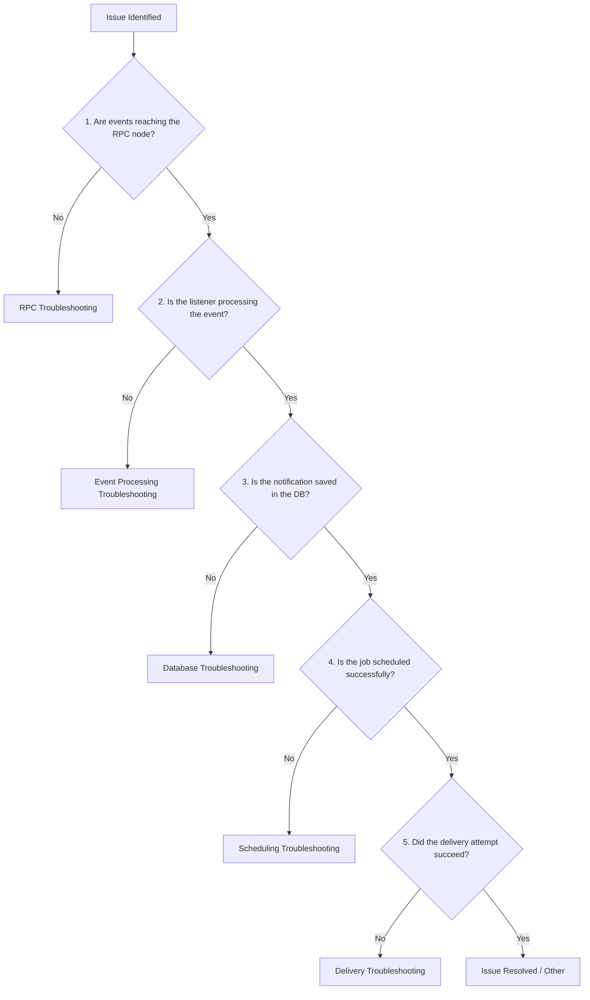

# Contributor Troubleshooting Flow

This guide helps contributors identify the root cause of issues in the Notify-Chain system. When a notification fails or the system behaves unexpectedly, use this flow to determine if the issue originates from the RPC, event processing, database, scheduling, or notification delivery layer.

## Overview Flow



---

## 1. RPC Troubleshooting

**Symptoms:**
- The contract emits events, but the backend doesn't seem to know about them.
- "Connection refused" or "Rate limit exceeded" in listener logs.

**Debugging Steps:**
1. **Verify RPC Connection:** Check if the RPC endpoint is accessible.
   ```bash
   curl -X POST -H "Content-Type: application/json" --data '{"jsonrpc":"2.0","method":"eth_blockNumber","params":[],"id":1}' $RPC_URL
   ```
2. **Check Rate Limits:** If using a public RPC, you might be hitting rate limits. Look for HTTP 429 errors.
3. **Validate Chain ID:** Ensure the listener is configured for the correct network (`CHAIN_ID` in `.env`).

**Relevant Logs & Metrics:**
- Logs: Search listener logs for `RpcError`, `Timeout`, or `ECONNREFUSED`.
- Metrics: `rpc_request_duration_seconds`, `rpc_error_rate`.

---

## 2. Event Processing Troubleshooting

**Symptoms:**
- RPC is fine, but specific events aren't being picked up.
- Logs show parsing errors or invalid contract ABIs.

**Debugging Steps:**
1. **Check ABI Consistency:** Ensure the contract ABI used by the listener matches the deployed contract version.
2. **Review Block Sync:** The listener might be out of sync. Check the `last_processed_block` in the listener's state or database.
3. **Parse Errors:** Verify that the event payload matches expected structures.

**Relevant Logs & Metrics:**
- Logs: Look for `AbiDecodeError`, `UnknownEvent`, or `BlockSyncFailed`.
- Metrics: `events_processed_total`, `blocks_behind_head`.

---

## 3. Database Troubleshooting

**Symptoms:**
- Events are processed, but notifications don't appear in the dashboard.
- High latency when querying notifications.
- Database connection errors.

**Debugging Steps:**
1. **Check DB Connectivity:** Verify that the backend services can connect to PostgreSQL/MongoDB.
2. **Verify Schema/Migrations:** Ensure all database migrations have been successfully applied.
3. **Review Query Performance:** Look for slow queries using the database's native tools (e.g., `pg_stat_statements`).

**Relevant Logs & Metrics:**
- Logs: Look for `ConnectionPoolExhausted`, `QueryTimeout`, or `MigrationPending`.
- Metrics: `db_connection_pool_active`, `db_query_duration_seconds`.

---

## 4. Scheduling Troubleshooting

**Symptoms:**
- Notifications are saved, but they sit in a "pending" state indefinitely.
- The queue is backing up.

**Debugging Steps:**
1. **Check Worker Status:** Ensure that the worker/scheduler processes are running and healthy.
2. **Inspect Queue Size:** If using Redis/RabbitMQ, check the queue size to see if tasks are accumulating.
3. **Review Task Payloads:** Sometimes malformed tasks get stuck in the queue, preventing subsequent tasks from executing.

**Relevant Logs & Metrics:**
- Logs: Look for `WorkerCrash`, `QueueFull`, or `TaskDeserializationError`.
- Metrics: `queue_depth`, `job_processing_latency`.

---

## 5. Notification Delivery Troubleshooting

**Symptoms:**
- Jobs execute, but users don't receive emails/webhooks.
- High bounce rates or timeout errors from third-party APIs (e.g., SendGrid, Mailgun).

**Debugging Steps:**
1. **Check API Keys:** Ensure third-party delivery service API keys are valid and not expired.
2. **Review Third-Party Status:** Check the status pages of the delivery providers.
3. **Inspect Payload:** Ensure the delivery payload (email address, webhook URL) is valid and formatted correctly.

**Relevant Logs & Metrics:**
- Logs: Look for `DeliveryFailed`, `Http401Unauthorized`, `WebhookTimeout`.
- Metrics: `delivery_success_rate`, `delivery_attempt_duration_seconds`.
