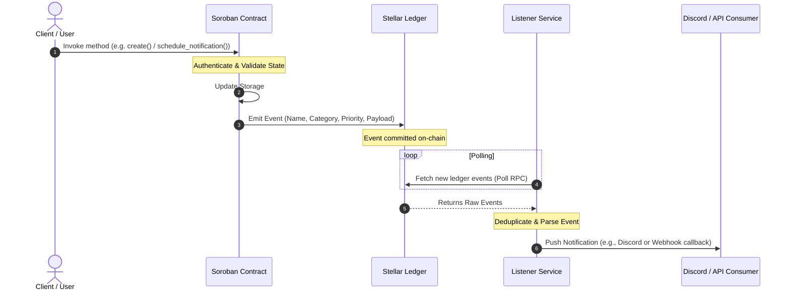

# NotifyChain — Smart Contract Architecture Guide

This document describes the smart contract architecture of NotifyChain, detailing the contract designs, component interactions, event flows, and deployment considerations.

---

## 1. System Overview

NotifyChain's smart contracts form the **on-chain source of truth** for the system. They execute business logic, manage state, and emit structured events to indicate important changes. The off-chain listener service subscribes to these events and routes them to external channels (like Discord or HTTP webhooks) and the web dashboard.

```mermaid
graph TD
    subgraph On-Chain (Soroban / Rust)
        AS[AutoShare Contract]
        TB[TaskBounty Contract]
    end

    subgraph Off-Chain (Node.js / TS)
        L[Listener Service]
        D[Dashboard UI]
    end

    AS -- emits events --> Stellar[Stellar Network]
    TB -- emits events --> Stellar
    Stellar -- event polling --> L
    L -- /api/events --> D
    L -- posts --> Discord[Discord / Webhooks]
```

---

## 2. Contract Structure & Codebase Layout

NotifyChain includes two primary contract implementations:

1. **AutoShare Contract** (`contract/contracts/hello-world/`): A subscription‑based group and payment management contract that supports scheduling, revoking, and expiring notifications on‑chain.
2. **TaskBounty Contract** (`Documents/Task Bounty/`): A decentralized task board allowing creators to escrow rewards, contributors to submit work, and arbitrators to resolve disputes.

### AutoShare Contract Directory Structure
*   [`lib.rs`](file:///workspaces/Notify-Chain/contract/contracts/hello-world/src/lib.rs): Entry point; declares the contract methods and binds them to the underlying implementation.
*   [`autoshare_logic.rs`](file:///workspaces/Notify-Chain/contract/contracts/hello-world/src/autoshare_logic.rs): Core logical implementations for group management, subscriptions, withdrawals, and scheduled notifications.
*   [`base/types.rs`](file:///workspaces/Notify-Chain/contract/contracts/hello-world/src/base/types.rs): Definitions for contract structures (`AutoShareDetails`, `GroupMember`, `ScheduledNotification`, `PaymentHistory`).
*   [`base/events.rs`](file:///workspaces/Notify-Chain/contract/contracts/hello-world/src/base/events.rs): Event structs and configuration enums (`NotificationCategory`, `NotificationPriority`).
*   [`base/errors.rs`](file:///workspaces/Notify-Chain/contract/contracts/hello-world/src/base/errors.rs): Custom error enums (e.g. `Paused`, `NotAdmin`, `Expired`).
*   [`interfaces/autoshare.rs`](file:///workspaces/Notify-Chain/contract/contracts/hello-world/src/interfaces/autoshare.rs): Traits defining public interface methods.

### TaskBounty Contract Directory Structure
*   [`lib.rs`](file:///workspaces/Notify-Chain/Documents/Task%20Bounty/src/lib.rs): Entry point and main contract interface methods.
*   [`task.rs`](file:///workspaces/Notify-Chain/Documents/Task%20Bounty/src/task.rs): Logic for creating and executing task/bounty workflows.
*   [`submission.rs`](file:///workspaces/Notify-Chain/Documents/Task%20Bounty/src/submission.rs): Logic for work submissions, approvals, and rejections.
*   [`dispute.rs`](file:///workspaces/Notify-Chain/Documents/Task%20Bounty/src/dispute.rs): Logic for dispute creation and resolution by arbitrators.
*   [`storage.rs`](file:///workspaces/Notify-Chain/Documents/Task%20Bounty/src/storage.rs): Storage helper access keys and patterns.
*   [`types.rs`](file:///workspaces/Notify-Chain/Documents/Task%20Bounty/src/types.rs): Structures representing tasks, submissions, and disputes.

---

## 3. Contract Responsibilities

| Contract | Core Responsibilities | State Managed | Access Control Rules |
| :--- | :--- | :--- | :--- |
| **AutoShareContract** | - Create & manage sharing groups<br>- Validate subscription balances & decrease usage count<br>- Support token payments & administrative withdrawals<br>- Maintain audit logs of scheduled notifications | - Group details & memberships<br>- Usage counters (subscription balance)<br>- Token support whitelist & usage fees<br>- Scheduled notification limits & metadata | - **Admin Only**: Pause/unpause, transfer admin, add/remove supported tokens, set usage fees, withdraw funds.<br>- **Creator Only**: Update group members, activate/deactivate group.<br>- **Creator / Admin**: Revoke scheduled notification. |
| **TaskBountyContract** | - Escrow bounty rewards<br>- Accept & review submissions<br>- Handle dispute arbitration<br>- Trigger reward payouts | - Task specifications & status<br>- Contributor work submissions<br>- Active dispute cases & arbitrator registries | - **Creator Only**: Create task, review work, release payout.<br>- **Contributor Only**: Submit work.<br>- **Arbitrator Only**: Resolve dispute. |

---

## 4. Component Interactions & Event Flows

On-chain smart contracts communicate asynchronously with off-chain systems using **Stellar Events**. Every state-changing action emits a structured event containing specific indexing topics.



### Event Structuring and Categorization

To support granular filtering by off-chain indexers, NotifyChain embeds a `NotificationCategory` and `NotificationPriority` as the **last two indexed topics** of every event.

#### 1. Notification Category
*   `Group` (0) — AutoShare group lifecycle changes.
*   `Admin` (1) — System actions (pauses, admin transfers).
*   `Financial` (2) — Withdrawals and fee transfers.
*   `Notification` (3) — Scheduled notifications (schedule, expiry, cancellation).

#### 2. Notification Priority
*   `Low` (0) — Routine updates.
*   `Medium` (1) — Standard operations.
*   `High` (2) — Important updates (requires quick review).
*   `Critical` (3) — Fund movements or administrative changes.

#### Topic Order Pattern
Every event follows this canonical topic schema:
`[ Event_Symbol, ...Indexed_Fields, Category, Priority ]`

*Example:* Emitting `ScheduledNotificationCancelled`:
*   `topics[0]`: `Symbol("scheduled_notification_cancelled")`
*   `topics[1]`: `Address(<caller>)` (Indexed field)
*   `topics[2]`: `u32(3)` (Category = `Notification`)
*   `topics[3]`: `u32(1)` (Priority = `Medium`)
*   `data`: `BytesN<32>` (contains `notification_id`)

---

## 5. Deployment Considerations

When deploying NotifyChain's contracts to Stellar networks (Testnet / Mainnet), consider the following lifecycle actions:

### Build
Compile the smart contracts to optimized WebAssembly targets:
```bash
cargo build --target wasm32-unknown-unknown --release
```
Optimized builds undergo post-processing (e.g., code-strip, WASM optimization) to reduce footprint and save gas.

### Installation & Deployment
1.  **Install WASM bytecode**:
    ```bash
    stellar contract install --wasm target/wasm32-unknown-unknown/release/hello_world.wasm --source <deployer-key> --network testnet
    ```
    This returns a `WASM_HASH`.
2.  **Deploy Contract Instance**:
    ```bash
    stellar contract deploy --wasm-hash <WASM_HASH> --source <deployer-key> --network testnet
    ```
    This returns the `CONTRACT_ID`.

### Initialization Checklist
After contract deployment, complete these initialization steps before routing traffic:
1.  **Initialize Admin**: Invoke `initialize_admin(admin: Address)` to establish the administrative account.
2.  **Whitelist Payment Tokens**: Invoke `add_supported_token(token: Address)` to allow specific Stellar Asset Contracts (SAC) to be used for subscription payments.
3.  **Configure Fees**: Invoke `set_usage_fee(fee: u32)` to set the usage fee (denominated in the supported asset).
4.  **Verify Status**: Ensure `get_paused_status()` returns `false`.

### Expiration & Revocation Semantics
*   **Time-to-Live (TTL)**: Notifications scheduled with `schedule_notification` carry a TTL (`ttl_seconds`). They are considered expired once `ledger_timestamp >= created_at + ttl_seconds`.
*   **Idempotency**: The listener handles expirations by calling `expire_notification`, which emits a `NotificationExpired` event, marking the state off-chain.
*   **Revocation**: An authorized creator or contract admin can call `revoke_notification` before the TTL expires, rendering it permanently cancelled.
