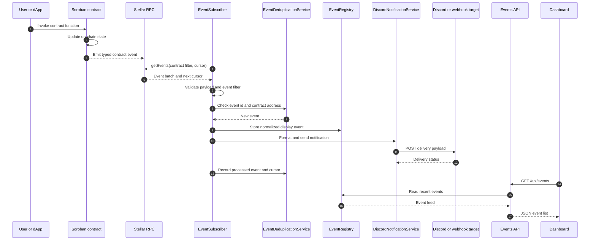
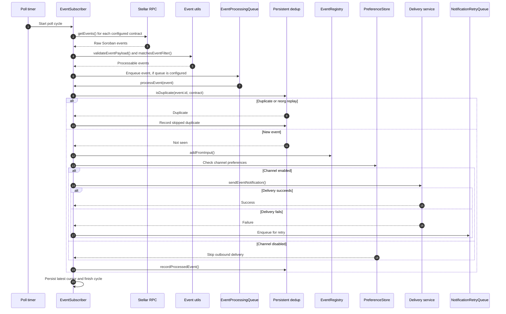
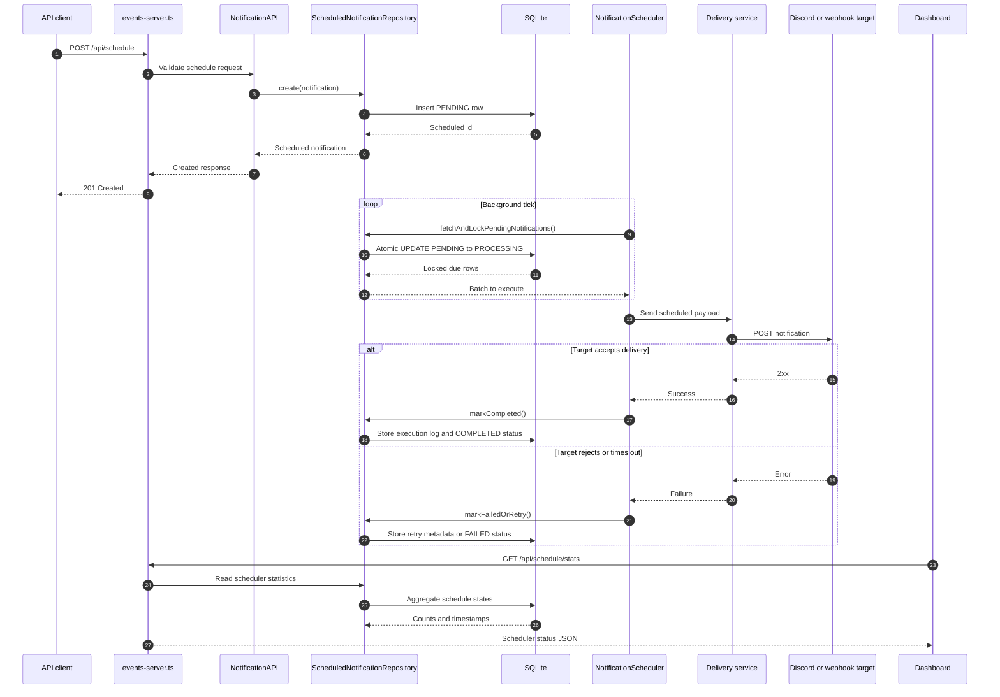

# API Sequence Diagrams

This document shows how NotifyChain moves notification data between callers,
Soroban contracts, the listener service, delivery targets, and API consumers.
The diagrams use Mermaid `sequenceDiagram` blocks so they render directly in
GitHub Markdown.

## Notification Request Flow

## Event Processing Lifecycle

## Scheduled Notification Lifecycle

## Reading Guide

- Contract events are defined in
  `contract/contracts/hello-world/src/base/events.rs` and
  `Documents/Task Bounty/src/events.rs`.
- Event ingestion and cursor handling live in
  `listener/src/services/event-subscriber.ts`.
- Persistent duplicate tracking lives in
  `listener/src/services/event-deduplication-service.ts`.
- The public event and scheduler endpoints are implemented in
  `listener/src/api/events-server.ts`.
- Dashboard clients consume the listener through `GET /api/events` and related
  scheduler endpoints.
